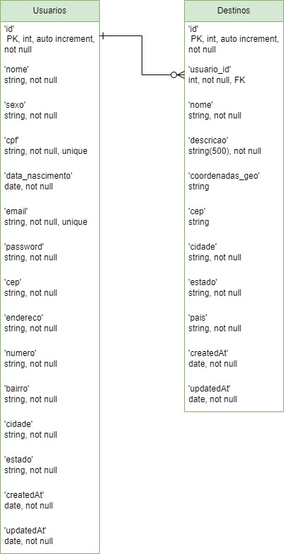

  
  <h1> 🪽 Birdy: Viaje leve, seja sustentável,  colecione histórias! </h1>

   Birdy é uma plataforma que visa promover viagens sustentáveis e experiências positivas para os usuários, fornecendo acesso a informações sobre destinos turísticos, praias, atrações naturais e atividades recreativas os quais os usuários poderão cadastrá-los em cada viagens que fizerem. Também podem explorar e descobrir novos destinos, encontrar dicas de viagem sustentável, com as experiências de outros viajantes.

  O nome 'Birdy' foi escolhido pensando na sensação de liberdade e aventura. 
O aplicativo permitirá aos usuários explorar novos destinos e experiências, desfrutando da beleza e diversidade da natureza de forma leve, como um passarinho.🐦
  
## 🏦 Módulo 1 - Projeto Avaliativo

Este repositório se baseia em um projeto avaliativo do curso FuturoDev 14/10/2024 encerrando o terceiro módulo com sua integração ao projeto frontEnd.
Seguindo um roteiro e aplicando as regras de negócio e rotas que devem ser criadas na aplicação com todas as regras de entrega do projeto avaliativo.

**Objetivo: Montagem e execução de uma aplicação Back-End, que deverá ser uma API Rest, codificada com uso do Node, Express e PostgreSQL - Software MVP**

A API Birdy deseja automatizar algumas ações de atendimento, criando um sistema para armazenamento de informações do usuário(s) e seus destino(s) que poderá servir para gerar um aplicativo que demonstra os pontos de interesses dos usuários para coletar dados, gerar marketing pra empresas de turismo, engajamento em rotas desconhecidas e melhorias de conservação da natureza local... As funcionalidades incluem o cadastro de novos usuários, listagem, edição e deleção de destinos, visualização de informações dos destinos, entre outras.

  *Bora usar as boas praticas de desenvolvimento de software!*

## 📉 Diagrama relacional

  

## 🤖 Como rodar o repositório:

Clone o repositório em sua máquina em uma pasta local 

`Git clone https://github.com/FuturoDEV-Trip/M3P-BackEnd-squad1.git`

### ⚠️IMPORTANTE!!!!! Na primeira vez é necessário instalar as dependências:

1. `npm install`
2. No documento criado de nome **.env**, rode no terminal: `cp .env_exemple .env` e configure com seus dados conforme a descrição e salve.

 ## 🏗️ Gere as estruturas das tabelas rodando a migration:

 1. Criar uma dataBase em seu postgress PGADMIN com o nome : viagem365 ou conforme configurado no arquivo .env.
 2. Rode o comando para fazer a migração das tabelas

`sequelize db:migrate`  

## 🌱 Alimente com os primeiros cadastros rodando o seeders:

Para ter valores inciais no banco de dados será necessário rodar o comando abaixo. Você terá alguns dados em seu banco de dados para testar login e destino: listar por usuário, atualizar algum existente ou deletar.

`npx sequelize-cli db:seed:all`

### Para rodar o repositório em ambiente local:

`node src/index.js`
  
## 🤖 Como rodar o Swagger:

`node ./swagger.js` 

## 🛝 Acesse pelo navegador:

[link] (http://localhost:3000/docs) ou a porta que esta no seu .env

## 📂 PARA ACESSAR A DOCUMENTAÇÃO ACESSE O LINK:

Caso tenha alguma dúvida!!

[SEQUELIZE](https://sequelize.org/docs/v6/core-concepts/model-basics/)

[SWAGGER Autogen](https://swagger-autogen.github.io/docs/)

  
## ✅ Validações importantes

- Token JWT - criado na rota login (email e senha do usuário) utilizado para autenticação das rotas privadas. Obs: Token com tempo de expiração de 15 minutos.
  
- Tabela usuário:
  Impor o preenchimento nome, sexo, CPF, data de nascimento, e-mail, senha, CEP, endereço, numero, Bairro, cidade e estado - todos obrigatórios.
  Cada usuário deve possuir um identificador único, incrementado automaticamente.
  CPF e email são único - não podem repetir nas colunas respectivas - cpf-check
  Não pode listar dados sensíveis como CPF e senha de login.
  Não pode editar o CPF.
  Não pode deletar usuários com locais de visitação em viagens associadas.
  Não pode cadastrar pessoas com o mesmo CPF.
  Não pode cadastrar pessoas com o mesmo e-mail.

- Tabela destinos:
  Informações do local: nome, descrição, localidade (CEP) e coordenadas geográficas, cidade e estado(UF)
  Nas rotas o id é extraído do seu token (feito no login)
  Com as coordenadas geograficas preenchidas, é feito a busca dos dados do local como, cep, cidade, estado e país, pela API externa nominatim-geocodere
  Cada usuário pode cadastrar um ou mais locais de visitação em viagens, fornecendo localização, e descrição do local.

  Para requisições geográficas:
- axios
- nominatim-geocodere colocada no banco de dados daquele destino.

  Somente o usuário daquele destino pode atualizar ou deletar seu(s) destino (s) cadastrado(s).
  
## 🛠️ Construído com

- Trello - usamos para documentar cada passo do desenvolvimento, incluindo o roteiro da aplicação, regras de negócio e validações exigidas.
- VSCode - utilizado para codificar a aplicação em Node.js.
- GitHub - seguimos o fluxo de trabalho do GitFlow, criando as branches main, develop e outras específicas para o desenvolvimento de cada etapa exigida.
- Node.js - utilizado como o ambiente de execução do JavaScript no back-end.
- Express - responsável por gerenciar a execução do código JavaScript no back-end.
- Sequelize - utilizado para a criação de migrations, models, controllers e rotas.
- Postgres - escolhido como o banco de dados.
- JWT - utilizado para gerar tokens para autenticação nas rotas privadas.
- Swagger - usado para criar manualmente a documentação da API.
- Seeders - utilizados para popular automaticamente o banco de dados com dados de teste ou iniciais.

## 🌊 GitFlow:

**Main:**
Começamos pela main organizando as pastas, deletando arquivos desnecessários e iniciando o projeto de forma limpa.

**developBack:**
Nossa base de desenvolvimento para criação de novas features.

**feature/EndPointsLogin** - implementação do login e geração do token com validade.

**feature/consultaCepCoordenadas** - integração com a API viaCEP para consulta de endereços e coordenadas pelos usuários.

**feature/padronizaStatusCode** - padronização dos status codes nas respostas da API.

**feature/listarAlterarDadosSensiveis** - implementação de regras para impedir a listagem e alteração de informações sensíveis como CPF.

**feature/readmeDiagrama** - adição do diagrama UML ao README e correção de código para permitir que o usuário atualize a senha.

**feature/readmeRevisao** - revisão e correções.
  
## 🧑🏻‍🏫 Professores para auxilio

* **Bruno Costa** - [GitHub](https://github.com/Bruno-Costa-fig)

## 👀 Melhorias

- Permitir comentários entre usuários: Implementar uma funcionalidade que permita aos usuários comentar nos destinos cadastrados por outros, promovendo interações e troca de experiências.
- Validação com YUP: Integrar a biblioteca YUP para melhorar a validação dos dados, garantindo que todas as informações sejam submetidas de forma correta e segura.
- URL amigável e dinâmica: Implementar a geração automática de URLs personalizadas com base nos destinos cadastrados, facilitando o - compartilhamento e o SEO da plataforma.
- Upload de fotos dos destinos: Adicionar a opção para os usuários fazerem upload de fotos dos destinos que cadastrarem, enriquecendo as informações e a experiência visual da plataforma.

## 🎁 Expressões de gratidão

* Floripa Mais Tec: Uma iniciativa da Prefeitura de Florianópolis em parceria com SENAI/SC, SEBRAE e ACATE, que tem como objetivo democratizar o ensino tecnológico, oferecendo cursos gratuitos de tecnologia para todos! 📢
* Lab365 e Monitores: Nossa gratidão a toda equipe do Lab365 e aos monitores pelo apoio e dedicação ao longo do curso.
* Equipe: Agradecemos aos melhores colegas de equipe que poderíamos ter, foi um prazer trabalhar com vocês!
* Sugestões e Feedbacks: Estamos abertos a qualquer dúvida ou sugestão de melhoria no código — todas as contribuições são bem-vindas! Algumas sugestões já foram mencionadas acima.
